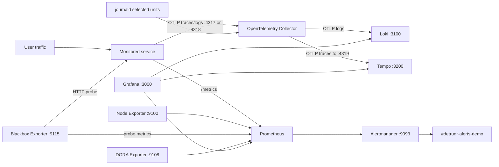
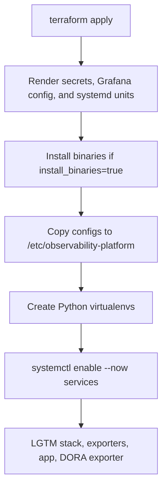
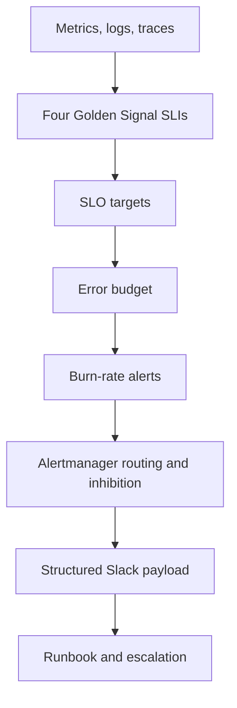
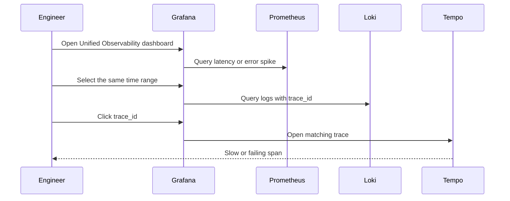

# Bare-Metal Observability Architecture

This platform runs an LGTM observability stack on a Linux host with systemd. Terraform renders configuration and unit files, then provisioning scripts install files into stable host paths and hand process supervision to systemd.

The architecture has two modes:

- **Monitor a local systemd service**: Prometheus scrapes localhost, Blackbox probes localhost, and the central OpenTelemetry Collector can read the service's journald logs.
- **Monitor a remote service**: Prometheus and Blackbox reach the service over the network, while logs and traces are pushed from an app-host OpenTelemetry Collector or the application process itself.

The bundled `test-api` is optional. It is a telemetry smoke-test workload, not the main monitored service.

## Component Responsibilities

| Component | Responsibility |
| --- | --- |
| Prometheus | Scrapes metrics, stores time series, evaluates alert rules. |
| Alertmanager | Groups and routes alerts to Slack. |
| Grafana | Provides dashboards and Explore workflows across metrics, logs, and traces. |
| Loki | Stores logs received through OTLP from the OpenTelemetry Collector. |
| Tempo | Stores traces received through OTLP from the OpenTelemetry Collector. |
| OpenTelemetry Collector | Receives OTLP logs/traces, reads selected journald units, enriches telemetry, exports to Loki and Tempo. |
| Node Exporter | Publishes host-level infrastructure metrics. |
| Blackbox Exporter | Probes HTTP availability, latency, and TLS certificate validity. |
| DORA Exporter | Publishes deployment frequency, lead time, change failure rate, and MTTR metrics. |
| `test-api` | Optional FastAPI workload for generating known metrics, logs, traces, latency, and errors. |

## LGTM data flow



When `deploy_test_api=true`, the same flow includes `test-api` as an extra local scrape target and journal source.

## Terraform provisioning flow



Terraform resources are intentionally lightweight:

- `local_file` and `local_sensitive_file` render generated config under `terraform/.generated`.
- `null_resource.validate_repository_config` catches invalid dashboard JSON and Python syntax before provisioning.
- `null_resource.install_bare_metal_prereqs` downloads binaries when `install_binaries=true`.
- `null_resource.provision_bare_metal_stack` runs `scripts/baremetal/provision.sh`.

Terraform state records the provisioning process, not cloud infrastructure. The host filesystem and systemd are the runtime control plane.

## Runtime Supervision

```text
systemd
  prometheus.service
  alertmanager.service
  loki.service
  tempo.service
  otel-collector.service
  node-exporter.service
  blackbox-exporter.service
  dora-exporter.service
  grafana-server.service
  test-api.service, only when deploy_test_api=true
```

Use `make status`, `make logs`, and `make health` for the common inspection path. For one service, use `systemctl status <unit> --no-pager` and `journalctl -u <unit> -f`.

## Reliability pipeline



Prometheus rules live in `observability/prometheus/rules`. Slack alert payloads are rendered by `observability/alertmanager/templates/slack.tmpl` and include severity, service/host labels, current value, dashboard links, and runbook links.

## Drill-down path



This is the intended incident workflow:

1. Start from Slack alert context.
2. Open the linked Grafana dashboard.
3. Confirm the symptom in Prometheus-backed panels.
4. Pivot to Loki logs for the same service and time window.
5. Follow `trace_id` derived fields into Tempo when traces are available.
6. Use the linked runbook for mitigation and escalation.

## Monitored Service Integration

### Local service

Use local mode when the application service runs on the observability host:

```hcl
monitored_service_name = "personal-trainer-be"
monitored_service_metrics_target = "127.0.0.1:8080"
monitored_service_health_url = "http://127.0.0.1:8080/api/v1/health"
monitored_service_systemd_unit = "personal-trainer-be.service"
collect_local_monitored_service_logs = true
```

Prometheus scrapes `/metrics`, Blackbox probes the health URL, and the collector reads the named systemd unit's journal.

### Remote service

Use remote mode when the application service runs on a different host:

```hcl
monitored_service_name = "personal-trainer-be"
monitored_service_metrics_target = "<app-private-ip-or-dns>:8080"
monitored_service_health_url = "http://<app-private-ip-or-dns>:8080/api/v1/health"
collect_local_monitored_service_logs = false
```

The observability host must reach the app host on the metrics and health-check ports. The app host must reach the observability host on OTLP ports `4317` and/or `4318` if it pushes logs or traces.

## Filesystem layout

```text
/etc/observability-platform/
  prometheus/
  alertmanager/
  grafana/
  loki/
  tempo/
  otel-collector/
  blackbox/
  secrets/

/var/lib/observability-platform/
  prometheus/
  alertmanager/
  loki/
  tempo/

/opt/observability-platform/
  services/test-api/
  services/dora-exporter/
```

Generated files flow from `terraform/.generated` into the runtime paths above. Do not edit files in `/etc/observability-platform` as the source of truth; update repository templates and re-run Terraform instead.

## Network Ports

| Port | Service |
| --- | --- |
| `3000` | Grafana |
| `9090` | Prometheus |
| `9093` | Alertmanager |
| `3100` | Loki API |
| `3200` | Tempo API |
| `4317` | OpenTelemetry Collector OTLP gRPC receiver |
| `4318` | OpenTelemetry Collector OTLP HTTP receiver |
| `8888` | OpenTelemetry Collector self-metrics |
| `8889` | OpenTelemetry Collector Prometheus exporter |
| `9100` | Node Exporter |
| `9108` | DORA Exporter |
| `9115` | Blackbox Exporter |
| `8081` | Optional `test-api` when `deploy_test_api=true` |

## Source of Truth

| Runtime concern | Source file or directory |
| --- | --- |
| Terraform variables | `terraform/variables.tf`, `terraform/terraform.tfvars` |
| Prometheus scrape config | `observability/prometheus/prometheus.yml.tftpl` |
| Prometheus alert rules | `observability/prometheus/rules/*.yml` |
| Collector pipelines | `observability/otel-collector/config.yml.tftpl` |
| Alertmanager routing | `observability/alertmanager/alertmanager.yml` |
| Slack alert template | `observability/alertmanager/templates/slack.tmpl` |
| Grafana dashboards | `observability/grafana/dashboards/*.json` |
| systemd units | `systemd/*.service.tftpl` |
