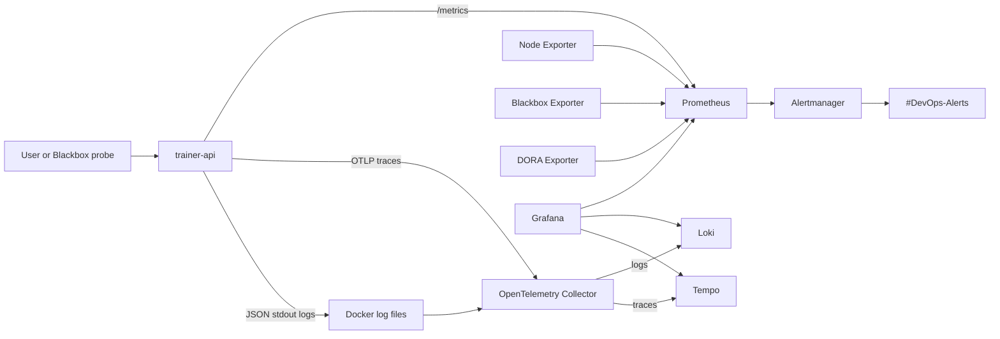
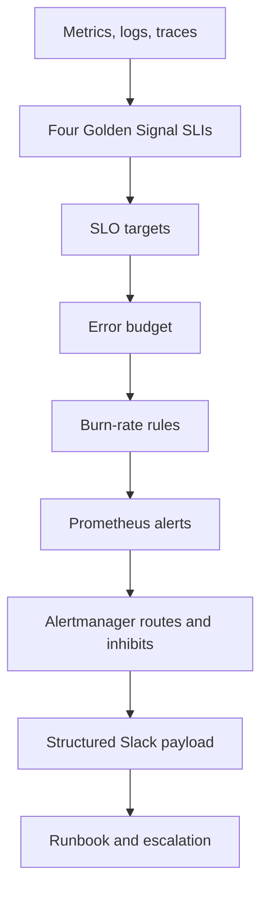
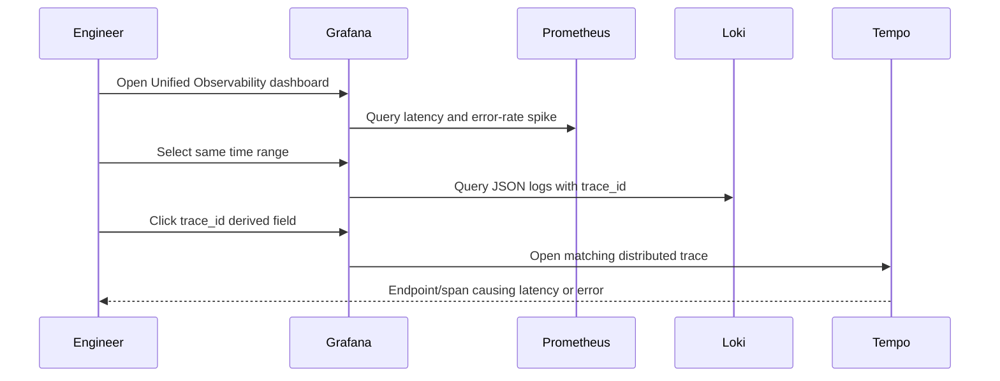
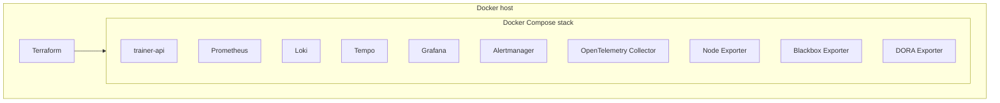

# Architecture

## LGTM data flow

```mermaid
flowchart LR
  U[User or Blackbox probe] --> API[trainer-api]
  API -->|/metrics| P[Prometheus]
  API -->|OTLP traces| OTel[OpenTelemetry Collector]
  API -->|JSON stdout logs| Docker[Docker log files]
  Docker --> OTel
  OTel -->|logs| Loki[Loki]
  OTel -->|traces| Tempo[Tempo]
  NE[Node Exporter] --> P
  BB[Blackbox Exporter] --> P
  Dora[DORA Exporter] --> P
  P --> AM[Alertmanager]
  AM --> Slack[#DevOps-Alerts]
  Grafana[Grafana] --> P
  Grafana --> Loki
  Grafana --> Tempo
```

## Reliability pipeline

```mermaid
flowchart TD
  Metrics[Metrics, logs, traces] --> SLIs[Four Golden Signal SLIs]
  SLIs --> SLOs[SLO targets]
  SLOs --> Budget[Error budget]
  Budget --> Burn[Burn-rate rules]
  Burn --> Alerts[Prometheus alerts]
  Alerts --> Alertmanager[Alertmanager routes and inhibits]
  Alertmanager --> Slack[Structured Slack payload]
  Slack --> Runbook[Runbook and escalation]
```

## Drill-down path

```mermaid
sequenceDiagram
  participant Engineer
  participant Grafana
  participant Prometheus
  participant Loki
  participant Tempo

  Engineer->>Grafana: Open Unified Observability dashboard
  Grafana->>Prometheus: Query latency and error-rate spike
  Engineer->>Grafana: Select same time range
  Grafana->>Loki: Query JSON logs with trace_id
  Engineer->>Grafana: Click trace_id derived field
  Grafana->>Tempo: Open matching distributed trace
  Tempo-->>Engineer: Endpoint/span causing latency or error
```

## Deployment topology

```mermaid
flowchart TB
  subgraph Host[Docker host]
    subgraph Compose[Docker Compose stack]
      API[trainer-api]
      P[Prometheus]
      L[Loki]
      T[Tempo]
      G[Grafana]
      A[Alertmanager]
      O[OpenTelemetry Collector]
      N[Node Exporter]
      B[Blackbox Exporter]
      D[DORA Exporter]
    end
    TF[Terraform]
  end
  TF --> Compose
```
