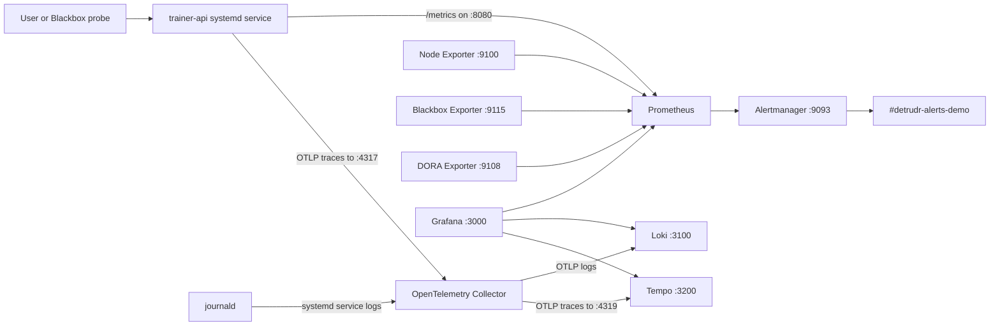
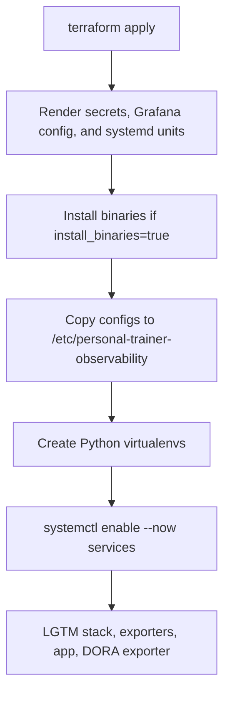
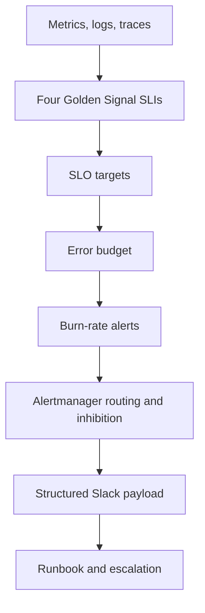
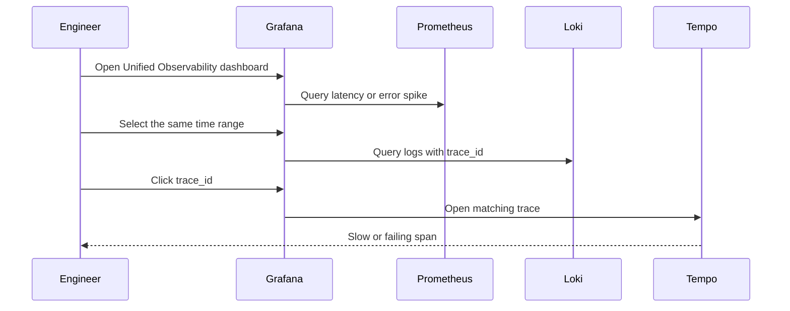

# Bare-Metal Architecture

## LGTM data flow



## Terraform provisioning flow



## Reliability pipeline



## Drill-down path



## Filesystem layout

```text
/etc/personal-trainer-observability/
  prometheus/
  alertmanager/
  grafana/
  loki/
  tempo/
  otel-collector/
  blackbox/
  secrets/

/var/lib/personal-trainer-observability/
  prometheus/
  alertmanager/
  loki/
  tempo/

/opt/personal-trainer-observability/
  services/trainer-api/
  services/dora-exporter/
```
